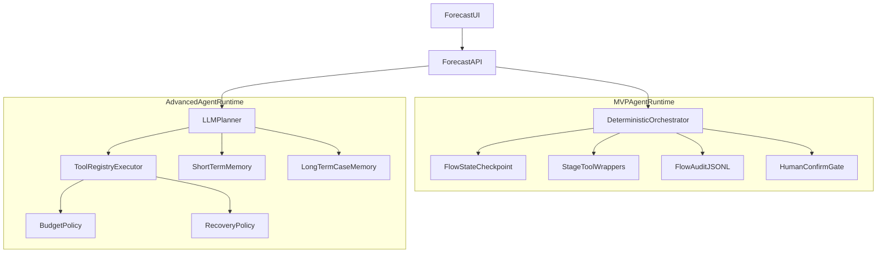

# 第四版修改方案：燃气预测从编排器升级为 Agent

## 1. 目标与范围

第四版目标：在不回退现有第三版能力（两次确认、比选、问答、Web 对话展示）的前提下，把当前“固定阶段编排”升级为“状态驱动、工具化、可恢复、可扩展”的 Agent 运行时。

本版先落地 **MVP Agent Runtime**，并给出 **Advanced Agent Runtime** 的演进路径：

- MVP：确定性编排 + 统一状态 + 工具包装 + 审计 + 恢复执行
- Advanced：受约束 Planner + 预算策略 + 记忆分层 + 统一 Agent 事件流

---

## 2. 当前问题（第三版的边界）

当前链路已经是“对话式编排器”，但还不是“自治 Agent”：

1. **固定流程硬编码**：执行顺序是 parse -> diagnose -> recommend -> compare -> qa，无法动态决策下一步。
2. **缺少统一状态模型**：任务状态散落在内存对象与阶段 payload 中，缺少可恢复的单一事实源。
3. **没有工具注册层**：阶段函数可复用，但没有统一工具协议、调用审计、可替换执行器。
4. **恢复能力不足**：任务失败后无法从最近检查点恢复，只能整单重跑。
5. **前端是阶段渲染器**：能展示流程，但不具备 Agent 事件流与恢复重试交互。

---

## 3. 第四版总体架构

---

## 4. 分阶段改造方案

## 4.1 M1：状态模型与检查点（FlowState）

目标：让每个任务都有可持久化、可恢复的状态快照。

- 新增 `FlowStage` 枚举和 `FlowState` 数据结构
- 每个阶段结束写 `flow_checkpoint.json`
- 任务元数据中增加 `lastCheckpoint`、`resumeFromStage`
- 保持现有消息协议兼容（不破坏前端第三版展示）

验收：

- 任务进行中可看到当前 stage 与最近检查点
- 服务重启后可识别已有检查点并支持恢复

## 4.2 M2：工具化阶段函数（Tool Wrapper + Registry）

目标：将现有阶段函数从“直接调用”改为“通过工具层调用”。

- 包装工具：`parse_intent`、`diagnose_importance`、`recommend_feature_superset`、`run_compare_and_rollup`、`ask_flow_qa`
- 增加基础注册表，按 name 路由工具
- 编排逻辑仍固定顺序，但调用口统一

验收：

- 编排器不直接依赖具体函数实现细节
- 新增工具可通过注册表接入，不改主流程骨架

## 4.3 M3：审计与可观测性（flow_audit.jsonl）

目标：每一步可追踪，便于排障与运维。

- 每步记录：step、开始/结束时间、耗时、输入摘要、输出摘要、错误信息
- 对 LLM 步骤附加：模型名、重试次数（不记录敏感数据）
- 在 task metrics 透出审计文件路径

验收：

- 任意失败任务都能定位在哪一步、为什么失败
- 可从审计日志统计每步平均耗时

## 4.4 M4：LLM 调用统一封装与轻量重试

目标：提高解析与推荐环节稳定性，减少偶发失败。

- 新增 forecast 专用 LLM client wrapper
- 统一 JSON 解析、异常格式化、重试策略（默认轻量重试）
- 适配节点：意图解析、continue 解析、特征推荐、结果问答

验收：

- 偶发网络/模型抖动可自动恢复
- 保持 fail-fast 语义（超过重试阈值明确报错）

## 4.5 M5：后端恢复执行 API（resume）

目标：从“只能重跑整单”升级为“从最近检查点恢复”。

- 保留现有 `start`
- 新增 `resume`（可指定 stage 或默认 last checkpoint）
- `get task` 返回 `lastCheckpoint`、`resumeFromStage`、`auditPath`

验收：

- 任务失败后可一键 resume
- resume 后 WS/轮询状态连续、前端可感知

## 4.6 M6：前端最小增强（不改信息架构）

目标：在不重做页面结构的前提下，补齐恢复能力与执行可见性。

- 失败状态展示“从最近检查点重试”按钮
- 阶段卡片附加工具执行摘要（耗时/状态）
- 继续沿用现有 stage card，避免一次性重构风险

验收：

- 用户可在页面直接触发恢复执行
- 能看到每阶段执行状态与耗时摘要

---

## 5. Advanced（第二阶段能力）

在 MVP 稳定后演进：

1. **Planner Loop**：由受约束 LLM Planner 决定下一步 `tool_call` / `finish`
2. **预算策略**：`max_llm_calls`、`max_tokens`、`max_runtime`、`max_model_trials`
3. **恢复策略**：工具级重试 + 计划级回退（例如推荐失败回落到重要性 Top-K 保底）
4. **记忆分层**：
  - 短期：会话上下文 + 最近工具输出
  - 长期：历史 case（省份、月份、特征组合、最优模型、误差）
5. **前端 Agent 事件流**：从 stage card 逐步升级到 `plan_step/tool_call/tool_result/reflection/human_gate`

---

## 6. 需要修改的文件（已有文件）

以下是第四版第一阶段（MVP）建议修改的现有文件：

1. `frontend-v2/backend/app.py`
  - 接入 FlowState/checkpoint
  - 接入工具调用层
  - 增加 resume API
  - 在 task 返回中透出 checkpoint/audit 元信息
2. `quantaalpha/forecast_agent/gas_forecast_flow.py`
  - 从“直接函数拼接”重构为“可被工具层调用的编排门面”
  - 对接统一 LLM wrapper（解析/推荐/continue/qa）
  - 对接状态与审计写入点
3. `frontend-v2/src/services/api.ts`
  - 新增 `resumeForecastAgentTask` 接口封装
  - 扩展 task 字段类型（checkpoint/audit）
4. `frontend-v2/src/context/TaskContext.tsx`
  - 增加 resume 调用与状态同步
  - 兼容新返回字段并下发给页面
5. `frontend-v2/src/pages/ForecastPage.tsx`
  - 增加失败后 checkpoint 恢复按钮
  - 显示阶段工具执行摘要（状态/耗时）

---

## 7. 需要新增的文件

## 7.1 Flow（状态层）

1. `quantaalpha/forecast_agent/flow/stages.py`
  - 定义 `FlowStage` 枚举与阶段常量
2. `quantaalpha/forecast_agent/flow/state.py`
  - 定义 `FlowState`、checkpoint 读写、摘要导出

## 7.2 Tools（工具层）

1. `quantaalpha/forecast_agent/tools/registry.py`
  - 工具注册、查找、调用协议
2. `quantaalpha/forecast_agent/tools/builtins.py`
  - 封装内置工具（parse/diagnose/recommend/compare/qa）
3. `quantaalpha/forecast_agent/tools/audit.py`
  - `flow_audit.jsonl` 写入器与审计事件结构

## 7.3 LLM（调用封装）

1. `quantaalpha/forecast_agent/llm/client_flow.py`
  - 统一 LLM 调用、JSON 解析、重试策略与错误标准化

## 7.4 Advanced（第二阶段预留）

1. `quantaalpha/forecast_agent/planner/llm_planner.py`
  - 受约束 planner（可后续再落地）
2. `quantaalpha/forecast_agent/policy/budget.py`
  - 预算策略（可后续再落地）
3. `quantaalpha/forecast_agent/policy/recovery.py`
  - 恢复策略（可后续再落地）
4. `quantaalpha/forecast_agent/memory/short_term.py`
  - 短期记忆（可后续再落地）
5. `quantaalpha/forecast_agent/memory/long_term.py`
  - 长期记忆（可后续再落地）

---

## 8. 建议

- Week 1：M1 + M3（状态 + 审计）
- Week 2：M2 + M4（工具化 + LLM 统一封装）
- Week 3：M5 + M6（resume API + 前端最小增强）
- Week 4+：Advanced（Planner/Policy/Memory/事件流）

---

## 9. 风险与控制

1. 风险：改造面大影响现网
  - 控制：保留第三版接口与消息协议，采用兼容 facade
2. 风险：LLM Planner 不稳定
  - 控制：先 MVP 固定编排，后开启受约束 Planner
3. 风险：状态分散导致维护复杂
  - 控制：FlowState 作为单一事实源，所有关键步骤落 audit 与 checkpoint

